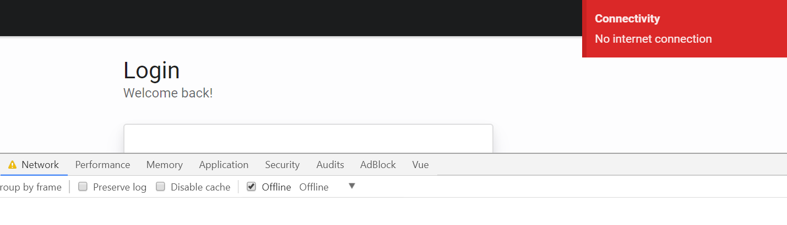

# vue-connection-listener

> Vue event bus plugin listening for online/offline changes



## About

Whenever the navigator's connection status changes a 'connection' event is emitted with a boolean payload indicating the new state (online = true, offline = false).

## Installation

```bash
npm install --save vue-connection-listener
```

[npm package link](https://www.npmjs.com/package/vue-connection-listener)

## Setup & example

main.js

```javascript
import Vue from 'Vue';
import bus from './bus'; // Event bus instance

Vue.prototype.$bus = bus; // Optional (but convenient)

import VueConnectionListener from 'vue-connection-listener';
const connectionListener = new VueConnectionListener(bus); // Create instance (injecting our bus)

new Vue({
  el: '#app',
  render: h => h(App),
  created() {
    connectionListener.register();
  },
  destroyed() {
    connectionListener.unregister();
  }
});
```

Inside any component

```javascript
  this.$bus.$on('connection', online => {
    alert(online ? 'You are online 😄' : 'You are offline 😞')
  });
```

## Notes

You need to import your own event bus and then inject it as a dependency.

Creating a bus could be as simple as creating a bus.js file with the following contents:

```javascript
import Vue from 'vue';
export default new Vue();
```

For more info:

https://alligator.io/vuejs/global-event-bus/

## Powered by

* Babel
* Webpack 4

## License

[MIT](http://opensource.org/licenses/MIT)

## Twitter

[Follow me on Twitter](https://twitter.com/KrolsBjorn)
